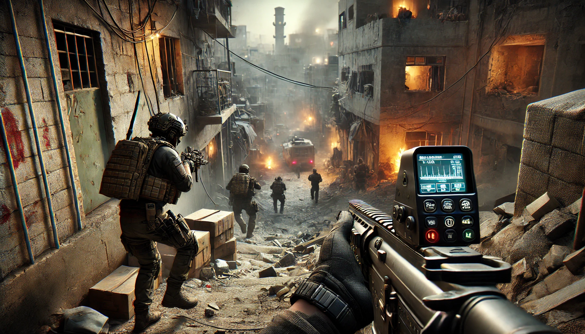
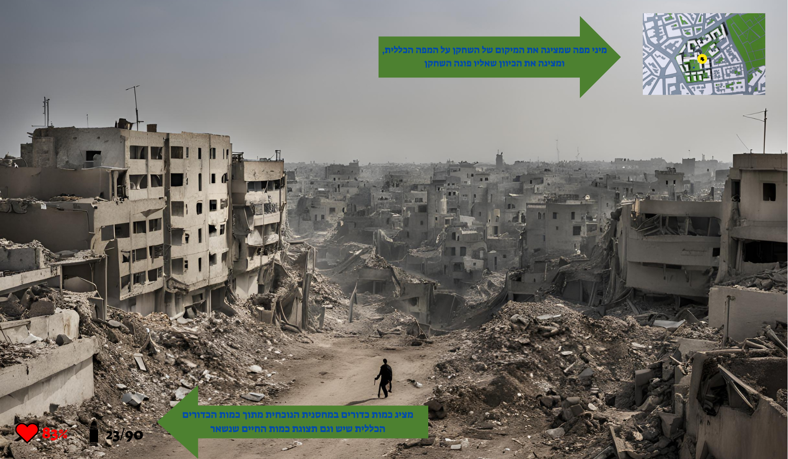
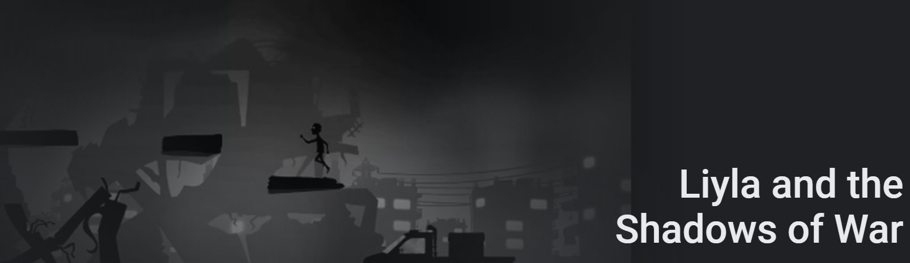
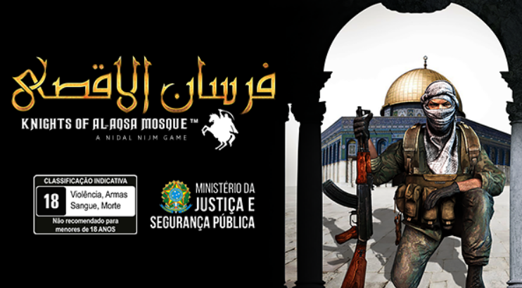
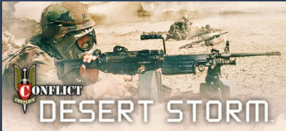

# חרבות ברזל

משחק מחשב שמתאר לחימה באזורים שונים בעזה מצד לוחם בצבא הגנה לישראל מול כוחות הרשע "חמאס"

## מהות המשחק

"חרבות ברזל" הוא משחק יריות בסגנון פעולה-הישרדות מותח, שבו השחקן מגלם לוחם בצבא ההגנה לישראל הנלחם מול כוחות חמאס בשטח עזה. המשחק כולל לחימה אינטנסיבית בתנאים מורכבים ונסיונות הישרדות במצבים מסוכנים, עם דגש על אסטרטגיה, שימוש במשאבים, והכרעה מהירה של איומים. המטרה היא להתקדם דרך אזורים עוינים, לחלץ חיילים ולהשיג יעדים חשובים בקרבות רוויי סכנות ואתגרים.

## פלטפורמות

המשחק מיועד לפלטפורמות המחשב האישי וקונסולות.

## מסך דמיון

---

## רכיבים רשמיים

### 1. שחקנים

- **קהל יעד**: המשחק מיועד לגילאי 16 ומעלה, עם רמת מיומנות בינונית עד גבוהה במשחקי פעולה ולחימה, וחובבי משחקים בעלי תוכן טקטי.
- **מספר שחקנים**: המשחק הוא עברו שחקן יחיד, שמטרתו לאתר מקורות מודיעין ולהציל חטופים משבי החמאס.
- **אינטראקציה בין השחקנים**: אין אינטרקציה עם שחנים אחרים.

### 2. יעדים

**יעדי השחקן**:

- לטווח קצר:לשמור על עצמו, להשיג מודיעין כדי להתוודע לסביבה העוניינת.
- לטווח בינוני: לאסוף משאבים כמו נשק ורפואה עבור כדי לשמור לשלבים הבאים שבהם קשה יותר למצוא חפצים.
- לטווח ארוך: להציל את השבויים מידי החמאס, ולטהר את השטח.
- **התראה על יעדים**: בתחילת המשחק יוצג הסבר על המשחק עצמו, ובתחילת כל שלב את מטרת השלב הנוכחי.

### 3. תהליכים

- **תהליך ההתחלה**: המשחק מתחיל בסצנת פתיחה קצרה שמראה את איזור הקרב מלמעלה כדי להכניס אותו לאווירת קרב. ואז תהיה סצינת אימונים קצרה כדי שילמד מה הם המקשים לכל פעולה.
- **תהליך הליבה**: השחקן נע באזורים עוינים, מתמודד עם יריבים, אוסף מידע ומשתמש בהם כדי לשרוד ולהתקדם. הפעולות כוללות הסתתרות, השגת מטרות, ופתרון אתגרים עם מקשי מקלדת ועכבר.
- **תהליך הסיום**: השחקן מסיים את המשחק בניצחון לאחר שסיים להשתלט על איזור מסויים שהוגדר בהתחלה או תבוסה במקרה של חוסר הצלחה בהשלמת המשימה. (פיתוח להמשך - להוסיף עוד שלבים שבכל שלב יהיה איזור אחר להשתלטות ואף שלבי בונוס שבהם השחקן יחזור לאיזורים שהיה בהם בעבר וכשהוא עזב אז מחבלים השתלטו עליו בחזרה)
- **למידה על התהליכים**: השחקן ילמד דרך הדרכות ראשוניות ותמיכה במשחק.

### 4. חוקים

- **הגבלות פעולה**: לכלי הנשק יש כמות מוגבלת, ושימוש יתר או תכנון לא נכון יוביל לתוצאה שלילית. לדוגמא מספר כדורים מוגבל.
- **קביעת תוצאות**: פגיעות מדויקות גורמות נזק רב יותר, ואילו טעויות קריטיות עלולות להוביל לפציעה.
- **לימוד החוקים**: מדריך פנימי מציג את חוקי המשחק הראשיים ומלמד את השחקן בשלב ההתחלה.

### 5. משאבים

- **סוגי משאבים**: תחמושת (קופסאות קרטון של תחמושת), ערכות עזרה ראשונה, ומידע מודיעיני (מפות). 
- **תועלת המשאבים**: מאפשרים לשחקן להמשיך במשחק ולהתמודד עם אתגרים.
- **השגת משאבים**: המשאבים נאספים באזורי הקרב או ממחסנים נטושים או על ידי הרגית אוייבים.
- **נדירות המשאבים**: המשאבים מוגבלים ויחייבו את השחקן לשקול את השימוש בהם בקפידה.
- **התראה על מצב משאבים**: מצב המשאבים יוצג בממשק בזמן אמת.
- 

### 6. עימותים

- **עימותים מרכזיים**:
  - בין השחקן למערכת: מכשולים כמו מלכודות ומבנים מסוכנים, אוייבים.
  - בין השחקן לשחקנים אחרים: אין.
  - בין השחקן לעצמו: דילמות אסטרטגיות האם לאסוף מודיעין כדי להבין יותר טוב את האיזור סביבי או להמשיך להתקדם כי הזמן אוזל.

### 7. גבולות

- **סוגי גבולות**: המשחק בעולם פתוח, לשחקן יש כיוון כללי אבל הוא יכול ללכת לאיזורים אחרים כדי למצוא משאבים.
- **עקרונות תיכנון**: יהיו איזורים שיהיו יותר מורכבים מבחינה מוסרית כמו בית ספר, בית חולים וכו שבהם באמת ההתמודדות תהיה יותר מוסרית, ויהיו איזורים כמו מפקדות ובסיסים שההתמודדות תהיה יותר קרבית. ויהיה איזון ביניהם.

### 8. תוצאות

- **תוצאות אפשריות**: הצלחה במילוי כל היעדים (ניצחון), הגעה לנקודות סיום ביניים (הישגים חלקיים), או תבוסה במקרה של מוות במשחק.
- **תלות במזל מול כישרון**: התוצאה תלויה בעיקר בכישרון, תכנון ואסטרטגיה. למשל האם לתקוף מאיפה שיותר קשה אבל האוייב פחות מצפה או מאיפה שיותר קל אבל האוייב שומר על המקום בהתאם.

# סקר שוק
מצאנו משחקים דומים כאשר חיפשנו בגוגל את הביטוי הבא: "combat game IDF Hamas urban Gaza Play Store"

## 1. **[Liyla and the Shadows of War](https://play.google.com/store/apps/details?id=org.liyla.war&pli=1)**

- משחק נרטיבי שמציג את המציאות של משפחה פלסטינית בעזה בזמן מלחמה. השחקן עוקב אחר ניסיונותיהם של אב ובתו לשרוד התקפות.

### במה המשחק שלנו שונה ?

משחק זה מציע חווית שחקן מצד פלסטיני שבורח מהתקפות. המשחק שלנו מציע חווית השחקן מצד לוחם בצבא ההגנה לישראל שמטרתו לא רק לשרוד התקפות של הצד השני אלא גם להשיג יעדים ,
לחלץ שבויים, לאסוף מודיעין. בנוסף, משחק זה הינו בדו-מימד ושלנו מתוכנן להיות תלת מימד.

## 2. **[Fursan al-Aqsa: The Knights of the Al-Aqsa Mosque](https://store.steampowered.com/app/1714420/Fursan_alAqsa_The_Knights_of_the_AlAqsa_Mosque/)**

- מאפשר לשחקנים להיכנס לנעליו של לוחם פלסטיני הנלחם באזורי עימות בפלסטין, כולל עזה. המשחק מציע משימות עם אלמנטים של לחימה עירונית ופעולות התגנבות שונות.

### במה המשחק שלנו שונה ?

משחק זה מציע חווית שחקן מהצד הפלסטיני.גם כאן היעדים שונים ובנוסף, המשחק שלנו מציג ערך מוסף של חוויה מאחדת בקרב עם ישראל לאחר אירועי השנה האחרונה .

## 3. **[Conflict: Desert Storm](https://store.steampowered.com/app/6060/Conflict_Desert_Storm/)**

- משחק וותיק יותר שמתמקד בלחימה במזרח התיכון, במשימות בהשראת מבצעים צבאיים בעיראק. המשחק משלב טקטיקות עם אקשן וכולל פיקוד על חוליה צבאית בסביבות לחימה מדבריות.

### במה המשחק שלנו שונה ?

המשחק שלנו מתמקד קודם כל באזור אחד (עזה/מנהרות עזה) ומתמקד במטרות שונות כמו לחלץ שבויים ולהשיג מידע מודיעי חשוב כדי להתקדם במשחק, מה שאין במשחק זה.

## רכיבים רשמיים שיבליטו את המשחק

- **חוקים ודילמות מוסריות**: הגבלות על פעולות השחקן שיוסיפו מימד מוסרי למשחק ויעמידו את השחקן בפני קונפליקטים מורכבים. לדוגמא- ילדים שמסתובבים ואוספים אוכל/ אוספים מידע ואתה לא יודע מה לעשות.
- **תהליכים ייחודיים**: פעולות של חילוץ והגנה, בהן השחקן לא רק נלחם, אלא גם מתמודד עם אתגרים הומניטריים בזמן אמת.

<\div>
